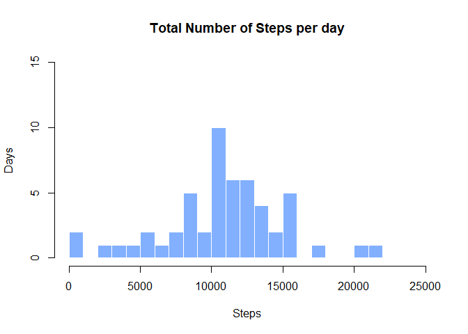
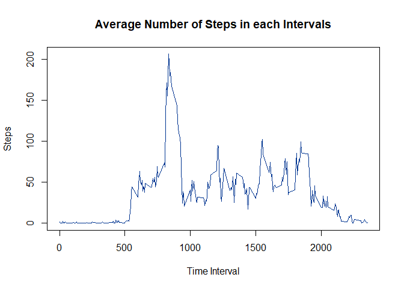
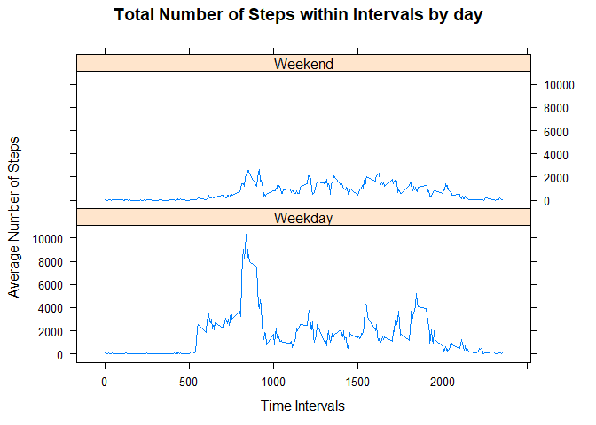

by Howie Zhou

Introduction
------------

It is now possible to collect a large amount of data about personal
movement using activity monitoring devices such as a Fitbit, Nike
Fuelband, or Jawbone Up. These type of devices are part of the
“quantified self” movement – a group of enthusiasts who take
measurements about themselves regularly to improve their health, to find
patterns in their behavior, or because they are tech geeks. But these
data remain under-utilized both because the raw data are hard to obtain
and there is a lack of statistical methods and software for processing
and interpreting the data.

This assignment makes use of data from a personal activity monitoring
device. This device collects data at 5 minute intervals through out the
day. The data consists of two months of data from an anonymous
individual collected during the months of October and November, 2012 and
include the number of steps taken in 5 minute intervals each day.

The data for this assignment can be downloaded from the course web site:

Dataset: Activity monitoring data \[52K\] The variables included in this
dataset are:

steps: Number of steps taking in a 5-minute interval (missing values are
coded as `NA`) date: The date on which the measurement was taken in
YYYY-MM-DD format interval: Identifier for the 5-minute interval in
which measurement was taken The dataset is stored in a
comma-separated-value (CSV) file and there are a total of 17,568
observations in this dataset.

This is an R Markdown document. Markdown is a simple formatting syntax
for authoring HTML, PDF, and MS Word documents. For more details on
using R Markdown see
<a href="http://rmarkdown.rstudio.com" class="uri">http://rmarkdown.rstudio.com</a>.

Assignment and Response
-----------------------

This assignment will be described in multiple parts. You will need to
write a report that answers the questions detailed below. Ultimately,
you will need to complete the entire assignment in a single R markdown
document that can be processed by knitr and be transformed into an HTML
file.

Throughout your report make sure you always include the code that you
used to generate the output you present. When writing code chunks in the
R markdown document, always use echo = TRUE so that someone else will be
able to read the code. This assignment will be evaluated via peer
assessment so it is essential that your peer evaluators be able to
review the code for your analysis.

For the plotting aspects of this assignment, feel free to use any
plotting system in R (i.e., base, lattice, ggplot2)

Fork/clone the GitHub repository created for this assignment. You will
submit this assignment by pushing your completed files into your forked
repository on GitHub. The assignment submission will consist of the URL
to your GitHub repository and the SHA-1 commit ID for your repository
state.

NOTE: The GitHub repository also contains the dataset for the assignment
so you do not have to download the data separately.

### Loading and preprocessing the data

Show any code that is needed to

We first need to install `dplyr` library for this assignment.

    library(dplyr)
    library(lattice)

1.  Load the data (i.e. read.csv())

<!-- -->

    filename <- "repdata_data_activity.zip"
    if (!file.exists(filename)){
        fileUrl <- "https://d396qusza40orc.cloudfront.net/repdata%2Fdata%2Factivity.zip"
        download.file(fileUrl, filename)
    }
    if (!file.exists("activity.csv")){
        unzip(filename)
    }

    rawData <- read.csv("activity.csv")
    str(rawData)

    ## 'data.frame':    17568 obs. of  3 variables:
    ##  $ steps   : int  NA NA NA NA NA NA NA NA NA NA ...
    ##  $ date    : chr  "2012-10-01" "2012-10-01" "2012-10-01" "2012-10-01" ...
    ##  $ interval: int  0 5 10 15 20 25 30 35 40 45 ...

    rawData$date <- as.Date(rawData$date)
    activity <- rawData[complete.cases(rawData), ]

1.  Process/transform the data (if necessary) into a format suitable for
    your analysis

<!-- -->

    filename <- "repdata_data_activity.zip"
    if (!file.exists(filename)){
        fileUrl <- "https://d396qusza40orc.cloudfront.net/repdata%2Fdata%2Factivity.zip"
        download.file(fileUrl, filename)
    }
    if (!file.exists("activity.csv")){
        unzip(filename)
    }

### What is mean total number of steps taken per day?

For this part of the assignment, you can ignore the missing values in
the dataset.

1.  Calculate the total number of steps taken per day

<!-- -->

    totalSteps <- aggregate(steps~date, activity, sum)
    head(totalSteps)

    ##         date steps
    ## 1 2012-10-02   126
    ## 2 2012-10-03 11352
    ## 3 2012-10-04 12116
    ## 4 2012-10-05 13294
    ## 5 2012-10-06 15420
    ## 6 2012-10-07 11015

1.  If you do not understand the difference between a histogram and a
    barplot, research the difference between them. Make a histogram of
    the total number of steps taken each day

<!-- -->

    hist(x = totalSteps$steps,
         breaks = 20,
         col = "#82b0ff",
         border = FALSE,
         xlim = c(0, 25000),
         ylim = c(0,15),
         main = "Total Number of Steps per day",
         xlab = "Steps",
         ylab = "Days")

1.  Calculate and report the mean and median of the total number of
    steps taken per day

<!-- -->

    mean1 <- round(mean(totalSteps$steps),2)
    median1 <- round(median(totalSteps$steps),2)

The MEAN of the total number of steps taken per day is 10766.19

The MEDIAN of the total number of steps taken per day is10765

### What is the average daily activity pattern?

1.  Make a time series plot (i.e. `type = "l"`) of the 5-minute interval
    (x-axis) and the average number of steps taken, averaged across all
    days (y-axis)

<!-- -->

    avgByInt <- aggregate(steps~interval, activity, mean)
    with(avgByInt, plot(interval, steps,
                        type = "l",
                        col = "#003591",
                        lwd = 1.5,
                        xlab = "Time Interval",
                        ylab = "Steps",
                        main = "Average Number of Steps in each Intervals"))

1.  Which 5-minute interval, on average across all the days in the
    dataset, contains the maximum number of steps?

<!-- -->

    avgByIntMax <- avgByInt[which.max(avgByInt$steps),1]

The time interval 835 contains the maximum number of steps.

### Imputing missing values

Note that there are a number of days/intervals where there are missing
values (coded as `NA`). The presence of missing days may introduce bias
into some calculations or summaries of the data.

1.  Calculate and report the total number of missing values in the
    dataset (i.e. the total number of rows with `NA`s)

<!-- -->

    nNas <- sum(!complete.cases(rawData))

The total number of missing values in the raw dataset is 2304.

1.  Devise a strategy for filling in all of the missing values in the
    dataset. The strategy does not need to be sophisticated. For
    example, you could use the mean/median for that day, or the mean for
    that 5-minute interval, etc.

*My strategy is to fill in all of the missing values with the average
value of the same time interval.*

1.  Create a new dataset that is equal to the original dataset but with
    the missing data filled in.

<!-- -->

    TFlist <- is.na(rawData$steps)
    imputedData <- rawData
    for (i in 1:length(TFlist)){
        if (TFlist[i]){
            imputedData[i , 1] <- avgByInt$steps[match(imputedData[i, 3], avgByInt$interval)]
        }
    }

And now we should have 0 NAs in the `imputedData`

1.  Make a histogram of the total number of steps taken each day and
    Calculate and report the mean and median total number of steps taken
    per day. Do these values differ from the estimates from the first
    part of the assignment? What is the impact of imputing missing data
    on the estimates of the total daily number of steps?

<!-- -->

    imputedTotal <- aggregate(steps~date, imputedData, sum)
    hist(x = imputedTotal$steps,
         breaks = 20,
         col = "#82b0ff",
         border = FALSE,
         xlim = c(0, 25000),
         ylim = c(0, 20),
         main = "Total Number of Steps per day",
         xlab = "Steps",
         ylab = "Days")

    mean2 <- round(mean(imputedTotal$steps),2)
    median2 <- round(median(imputedTotal$steps), 2)

After imputing, the MEAN of the total number of steps taken per day is
10766.19

After imputing, the MEDIAN of the total number of steps taken per day is
10766.19

Compared to the previous mean and median, the new mean remained the same
as the old one, while the median increased to 10766.19. Because of same
interval average strategy, the mean will not change. However, because
previsou mean is greater than median, adding mean values will converge
median to mean. This explains why the new mean value is equal to the new
median value.

### Are there differences in activity patterns between weekdays and weekends?

For this part the `weekdays()` function may be of some help here. Use
the dataset with the filled-in missing values for this part.

1.  Create a new factor variable in the dataset with two levels -
    “weekday” and “weekend” indicating whether a given date is a weekday
    or weekend day.

<!-- -->

    imputedData$date <- as.Date(imputedData$date)
    totalNew<- mutate(imputedData, 
                      day = ifelse(weekdays(imputedData$date)=="Saturday" | 
                                   weekdays(imputedData$date)=="Sunday", "Weekend", "Weekday"))
    head(totalNew)

    ##       steps       date interval     day
    ## 1 1.7169811 2012-10-01        0 Weekday
    ## 2 0.3396226 2012-10-01        5 Weekday
    ## 3 0.1320755 2012-10-01       10 Weekday
    ## 4 0.1509434 2012-10-01       15 Weekday
    ## 5 0.0754717 2012-10-01       20 Weekday
    ## 6 2.0943396 2012-10-01       25 Weekday

1.  Make a panel plot containing a time series plot (i.e. `type = "l"`)
    of the 5-minute interval (x-axis) and the average number of steps
    taken, averaged across all weekday days or weekend days (y-axis).
    See the README file in the GitHub repository to see an example of
    what this plot should look like using simulated data.

First, process the imputed data and calculate average steps per interval
per day.

    avgByDayInt <- group_by(totalNew, day, interval) %>%
        summarise(avgSteps = sum(steps))

    ## `summarise()` regrouping output by 'day' (override with `.groups` argument)

Then plot the data to a histogram

    with(avgByDayInt, 
         xyplot(avgSteps ~ interval | day,
                layout = c(1, 2),
                type = "l",      
                main = "Total Number of Steps within Intervals by day",
                xlab = "Time Intervals",
                ylab = "Average Number of Steps"))

